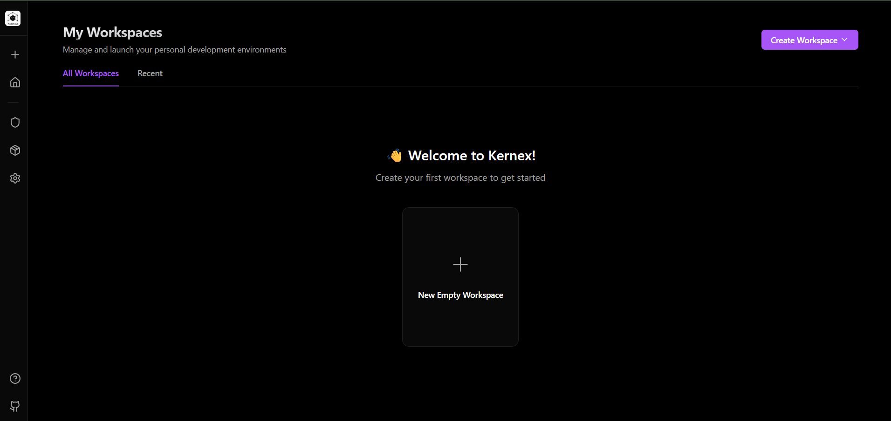
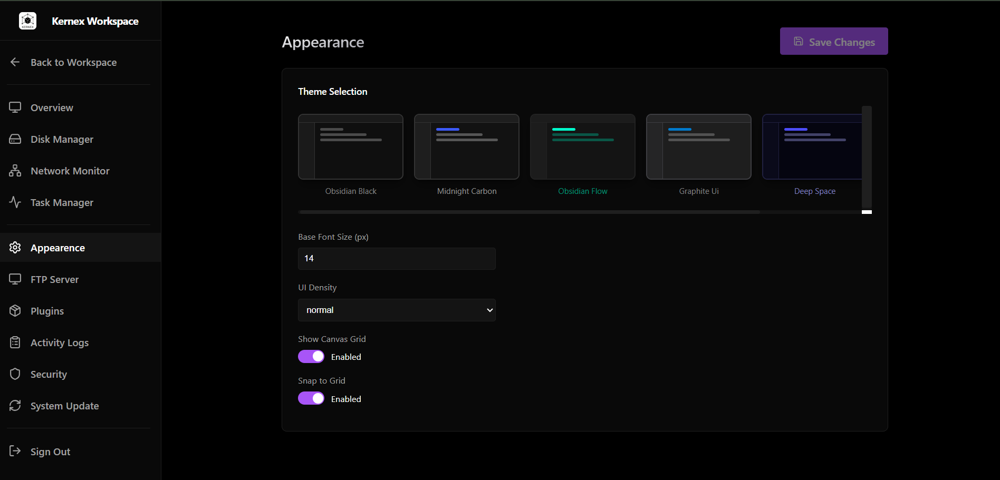

<div align="center">

  <h1>Kernex</h1>
  <p><b>Your Personal Programmable Workspace.</b></p>
  <p>A self-hosted, infinite-canvas OS for your developer tools.</p>

  
  <br />

  <p>
    <a href="#-what-is-kernex">About</a> •
    <a href="#-features">Features</a> •
    <a href="#-installation">Installation</a> •
    <a href="docs/DEPLOYMENT.md">Deployment</a> •
    <a href="docs/PLUGINS.md">Plugin Guide</a> •
    <a href="CONTRIBUTING.md">Contributing</a>
  </p>

  [](https://opensource.org/licenses/MIT)
</div>

---

## 🌌 What is Kernex?

**Kernex** is a developer-first, self-hosted workspace that runs on your machine (or server) and is accessed via your browser. It reimagines the "desktop" as an **infinite 2D canvas** where your tools (Terminal, Notes, HTTP Tester, File Manager) live as persistent nodes.

Unlike a traditional desktop OS where windows overlap and hide each other, Kernex lets you organize your workflows spatially.

**Why?**
*   **Context Switching:** Keep related tools (e.g., a terminal, a note, and an API tester) grouped together visually.
*   **Persistence:** Your "desktop" state is saved on the server. Reload the browser, and everything is exactly where you left it.
*   **Ownership:** No cloud accounts. No tracking. You own the data.

## 📸 Gallery

<p align="center">
  
  
</p>
<p align="center">
  
</p>

---

## 🛠 Features

*   **🗺 Infinite Canvas:** Pan, zoom, and organize tools spatially.
*   **🧱 Persistent Nodes:** Tools run as isolated instances that save their state.
*   **🔌 Plugin Architecture:** Extensible via simple HTML/React plugins.
*   **📂 File Manager:** Browse and manage your server's real filesystem.
*   **💻 Terminal:** Full xterm.js shell access to the host (Secure & Persistent).
*   **🧪 Developer Tools:**
    *   **HTTP Tester:** Postman-lite for API testing.
    *   **JSON/YAML/XML Tools:** Formatters and validators.
    *   **Diff Viewer:** Compare text with syntax highlighting.
    *   **Crypto Tools:** Hashing, Base64, HMAC.
*   **🔒 Security:** 
    *   Strong Session Management (1h expiry).
    *   Encrypted Secrets Storage (AES-256-GCM).
    *   Secure Path Traversal Protection.
    *   Rate-limited WebSockets.

---

## 🚀 Installation

### Prerequisites
*   **Node.js v20+**
*   **Linux / macOS / WSL2** (Windows is supported via WSL2)

### Quick Start

1.  **Clone the repository:**
    ```bash
    git clone https://github.com/Arjun-M/Kernex.git
    cd Kernex
    ```

2.  **Install dependencies:**
    ```bash
    npm install
    ```

3.  **Start the system:**
    
    Open two terminal tabs:

    ```bash
    # Terminal 1: Start the Backend (Port 3000)
    npm run server
    ```

    ```bash
    # Terminal 2: Start the Frontend (Port 5173)
    npm run dev
    ```

4.  **Access the workspace:**
    Open `http://localhost:5173` in your browser.
    
    *First run will prompt you to set up an admin account.*

---

## 🔒 Security & Deployment

Kernex is designed to be self-hosted. For production deployment, ensure you:

1.  **MANDATORY**: Set `KERNEX_ENCRYPTION_KEY` environment variable (64-character hex string) for secret encryption. The server will **fail to start** in production if this is missing.
2.  Run behind a reverse proxy (Nginx/Caddy) with HTTPS.
3.  Do **not** run as root user.

See [Deployment Guide](docs/DEPLOYMENT.md) for details.

## 📦 Build & Development

The project now includes strict type-checking for both client and server code.

```bash
# Run full project type check and build
npm run build
```

---

## 📖 Documentation

*   **[Architecture Overview](docs/ARCHITECTURE.md)** - Learn how Kernex is built (Fastify + React + SQLite).
*   **[Plugin Development](docs/PLUGINS.md)** - Learn how to build your own tools for Kernex.

---

## 🤝 Contributing

We welcome contributions! Whether it's a new plugin, a bug fix, or a UI improvement.
Please read our [Contributing Guide](CONTRIBUTING.md) to get started.

## 📄 License

MIT © [Arjun-M](https://github.com/Arjun-M)
